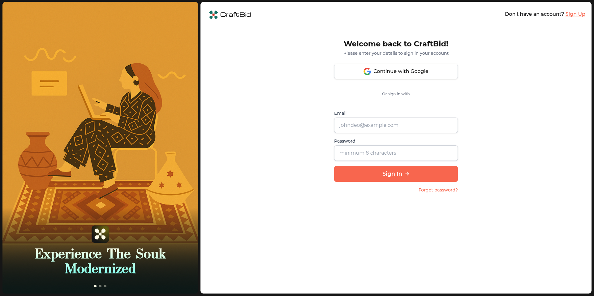

# CraftBid 🎨

<p align="center">
  
   
</p>

<p align="center">
  <strong>Experience The Souk Modernized</strong>
</p>

<p align="center">
  A modern online auction platform connecting artisans with buyers, built with Laravel and React.
</p>

---

## 📋 Table of Contents

- [About](#about)
- [Features](#features)
- [Tech Stack](#tech-stack)
- [Installation](#installation)
- [Docker Installation](#-docker-installation)
- [Azure Deployment](#-azure-deployment)
- [Configuration](#configuration)
- [Usage](#usage)
- [Project Structure](#project-structure)
- [API Documentation](#api-documentation)
- [Contributing](#contributing)
- [License](#license)

## 🎯 About

CraftBid is a full-stack e-commerce auction platform designed to modernize traditional souk (marketplace) experiences. It enables artisans to showcase and sell their handmade products through online auctions, while buyers can discover unique items and participate in real-time bidding.

### Key Concepts

- **Artisans**: Verified craft makers who can create products and manage auctions
- **Buyers**: Users who browse and bid on auction items
- **Admins**: Platform administrators managing users, categories, and system settings
- **Real-time Bidding**: Live auction updates using Laravel Reverb and WebSockets

## ✨ Features

### For Artisans
- ✅ Product management (create, edit, delete products)
- ✅ Auction creation and management
- ✅ Dashboard with statistics and analytics
- ✅ Revenue tracking and charts
- ✅ Profile verification system
- ✅ ID document upload for verification
- ✅ Withdrawal requests

### For Buyers
- ✅ Browse active auctions
- ✅ Real-time bidding with instant updates
- ✅ Bid history tracking (Winning, Outbid, Won, Lost)
- ✅ Wallet management
- ✅ Transaction history
- ✅ Watchlist functionality

### For Admins
- ✅ User management
- ✅ Category CRUD operations
- ✅ Artisan verification system
- ✅ Product and auction management
- ✅ Withdrawal request approval
- ✅ Financial reports
- ✅ System settings management

### Platform Features
- 🔐 Authentication with email verification
- 🔑 Google OAuth integration
- 💰 Wallet system with bid holds
- 📊 Real-time auction updates
- 🔔 Notification system
- 📱 Responsive design
- 🎨 Modern UI with Tailwind CSS
- ⚡ Anti-sniping protection

## 🛠 Tech Stack

### Backend
- **Framework**: Laravel 12
- **PHP**: 8.2+
- **Database**: SQLite (development) / MySQL/PostgreSQL (production)
- **Authentication**: Laravel Sanctum
- **Real-time**: Laravel Reverb
- **OAuth**: Laravel Socialite (Google)

### Frontend
- **Framework**: React 18
- **Language**: TypeScript
- **Styling**: Tailwind CSS 4
- **UI Components**: Radix UI
- **Charts**: Recharts
- **Forms**: React Hook Form + Zod
- **Routing**: React Router DOM
- **HTTP Client**: Axios
- **Real-time**: Laravel Echo + Pusher

### Development Tools
- **Build Tool**: Vite
- **Package Manager**: npm
- **Testing**: Pest PHP
- **Code Quality**: ESLint, Laravel Pint

## 🚀 Installation

### Prerequisites

- PHP 8.2 or higher
- Composer
- Node.js 18+ and npm
- SQLite (or MySQL/PostgreSQL)

### Backend Setup

1. **Clone the repository**
   ```bash
   git clone https://github.com/Ibrahim-Lmlilas/craft.git
   cd CraftBid
   ```

2. **Install PHP dependencies**
   ```bash
   composer install
   ```

3. **Environment configuration**
   ```bash
   cp .env.example .env
   php artisan key:generate
   ```

4. **Database setup**
   ```bash
   php artisan migrate
   php artisan db:seed
   ```

5. **Storage link**
   ```bash
   php artisan storage:link
   ```

### Frontend Setup

1. **Navigate to UI directory**
   ```bash
   cd UI_CraftBid
   ```

2. **Install dependencies**
   ```bash
   npm install
   ```

3. **Environment configuration**
   Create `.env` file in `UI_CraftBid/`:
   ```env
   VITE_API_BASE_URL=http://localhost:8000
   ```

### Running the Application

**Option 1: Run separately**

Backend:
```bash
php artisan serve
php artisan reverb:start
```

Frontend:
```bash
cd UI_CraftBid
npm run dev
```

**Option 2: Run together (recommended)**
```bash
composer dev
```

This will start:
- Laravel server (http://localhost:8000)
- Queue worker
- Laravel Pail (logs)
- Vite dev server (http://localhost:5173)

## 🐳 Docker Installation

### Prerequisites
- Docker Engine 20.10+
- Docker Compose 2.0+

### Quick Start with Docker

1. **Clone the repository**
   ```bash
   git clone https://github.com/Ibrahim-Lmlilas/craft.git
   cd CraftBid
   ```

2. **Create environment file**
   ```bash
   cp .env.example .env
   ```

3. **Update `.env` file with Docker settings**
   ```env
   DB_CONNECTION=mysql
   DB_HOST=mysql
   DB_PORT=3306
   DB_DATABASE=craftbid
   DB_USERNAME=craftbid
   DB_PASSWORD=root

   # Reverb Configuration
   BROADCAST_DRIVER=reverb
   REVERB_APP_ID=app-id
   REVERB_APP_KEY=app-key
   REVERB_APP_SECRET=app-secret
   REVERB_HOST=reverb
   REVERB_PORT=8080

   # Google OAuth (if using)
   GOOGLE_CLIENT_ID=your_client_id
   GOOGLE_CLIENT_SECRET=your_client_secret
   GOOGLE_REDIRECT_URI=http://localhost:8000/api/auth/google/callback
   ```

4. **Build and start containers**
   ```bash
   docker-compose up -d --build
   ```

5. **Access the application**
   - Frontend: http://localhost:5173
   - Backend API: http://localhost:8000
   - WebSocket (Reverb): ws://localhost:8080
   - Nginx (if enabled): http://localhost:80

### Docker Services

The `docker-compose.yml` includes the following services:

- **mysql**: MySQL 8.0 database
- **backend**: Laravel application server
- **queue**: Laravel queue worker
- **reverb**: Laravel Reverb WebSocket server
- **frontend**: React frontend (production build)
- **nginx**: Reverse proxy (optional)

### Docker Commands

**Start all services:**
```bash
docker-compose up -d
```

**Stop all services:**
```bash
docker-compose down
```

**View logs:**
```bash
docker-compose logs -f
```

**View specific service logs:**
```bash
docker-compose logs -f backend
docker-compose logs -f frontend
```

**Rebuild containers:**
```bash
docker-compose up -d --build
```

**Execute commands in containers:**
```bash
# Run artisan commands
docker-compose exec backend php artisan migrate

# Access backend container shell
docker-compose exec backend bash

# Access frontend container shell
docker-compose exec frontend sh
```

**Reset database:**
```bash
docker-compose exec backend php artisan migrate:fresh --seed
```

**Stop and remove volumes (clean slate):**
```bash
docker-compose down -v
```

### Development vs Production

**Development Mode (with hot reload):**
```bash
# Use development override
docker-compose -f docker-compose.yml -f docker-compose.dev.yml up -d
```
- Frontend runs with Vite dev server (hot reload enabled)
- Backend runs with `php artisan serve`
- Volumes are mounted for live code changes
- Changes reflect immediately without rebuilding

**Production Mode:**
```bash
# Standard production build
docker-compose up -d --build
```
- Frontend is built and served via Nginx
- Backend runs with `php artisan serve`
- Optimized builds and caching enabled

### Troubleshooting

**Port already in use:**
- Change ports in `docker-compose.yml` or `.env`
- Example: `APP_PORT=8001:8000`

**Permission issues:**
```bash
sudo chown -R $USER:$USER storage bootstrap/cache
```

**Database connection errors:**
- Ensure MySQL container is healthy: `docker-compose ps`
- Check database credentials in `.env`
- Wait for MySQL to be ready before starting backend

**Clear cache:**
```bash
docker-compose exec backend php artisan cache:clear
docker-compose exec backend php artisan config:clear
docker-compose exec backend php artisan route:clear
```

## ☁️ Azure Deployment

### Prerequisites

- Azure Account ([Get free account](https://azure.microsoft.com/free/))
- Azure CLI installed
- Git installed

### Quick Deployment

1. **Install Azure CLI** (if not installed):
   ```bash
   # Linux
   curl -sL https://aka.ms/InstallAzureCLIDeb | sudo bash
   
   # macOS
   brew install azure-cli
   ```

2. **Login to Azure**:
   ```bash
   az login
   ```

3. **Run deployment script**:
   ```bash
   chmod +x deploy-azure.sh
   ./deploy-azure.sh
   ```

The script will automatically:
- Create Resource Group
- Create Azure Database for MySQL
- Create App Service Plan
- Deploy Web App with Docker Compose
- Configure all settings

### Manual Deployment

For detailed step-by-step instructions, see [AZURE_DEPLOYMENT.md](./AZURE_DEPLOYMENT.md)

### What Gets Deployed

- **Backend**: Laravel API (Port 8000)
- **Frontend**: React SPA (Port 80)
- **Nginx**: Reverse Proxy (Port 8080)
- **Database**: Azure Database for MySQL

### Post-Deployment Steps

1. **Configure Google OAuth**:
   - Update `GOOGLE_CLIENT_ID` and `GOOGLE_CLIENT_SECRET` in App Settings
   - Update redirect URI in Google Cloud Console

2. **Run Migrations**:
   ```bash
   az webapp ssh --resource-group craftbid-rg --name craftbid-app
   php artisan migrate --force
   php artisan db:seed --force
   ```

3. **Access Your App**:
   - URL: `https://craftbid-app.azurewebsites.net`

### Monitoring

**View Logs**:
```bash
az webapp log tail --resource-group craftbid-rg --name craftbid-app
```

**Check Status**:
```bash
az webapp show --resource-group craftbid-rg --name craftbid-app --query state
```

### Cost Estimation

- **App Service Plan (B1)**: ~$13/month
- **Azure Database for MySQL (B1ms)**: ~$12/month
- **Total**: ~$25-30/month

> 💡 Use Free Tier for testing (with limitations)

For complete deployment guide, see [AZURE_DEPLOYMENT.md](./AZURE_DEPLOYMENT.md)

## ⚙️ Configuration

### Google OAuth Setup

1. Create a Google OAuth application at [Google Cloud Console](https://console.cloud.google.com/)
2. Add credentials to `.env`:
   ```env
   GOOGLE_CLIENT_ID=your_client_id
   GOOGLE_CLIENT_SECRET=your_client_secret
   GOOGLE_REDIRECT_URI=http://localhost:8000/api/auth/google/callback
   ```

### Database Configuration

Update `.env` with your database credentials:
```env
DB_CONNECTION=sqlite
# Or for MySQL/PostgreSQL:
# DB_CONNECTION=mysql
# DB_HOST=127.0.0.1
# DB_PORT=3306
# DB_DATABASE=craftbid
# DB_USERNAME=root
# DB_PASSWORD=
```

### Reverb Configuration

Configure broadcasting in `.env`:
```env
BROADCAST_DRIVER=reverb
REVERB_APP_ID=your_app_id
REVERB_APP_KEY=your_app_key
REVERB_APP_SECRET=your_app_secret
REVERB_HOST=localhost
REVERB_PORT=8080
```

## 📁 Project Structure

```
CraftBid/
├── app/
│   ├── Console/Commands/      # Artisan commands
│   ├── Events/                # Event classes
│   ├── Http/
│   │   ├── Controllers/       # API controllers
│   │   └── Middleware/        # Custom middleware
│   ├── Models/                # Eloquent models
│   ├── Services/              # Business logic services
│   └── Traits/                # Reusable traits
├── database/
│   ├── migrations/            # Database migrations
│   └── seeders/               # Database seeders
├── routes/
│   └── api.php                # API routes
├── UI_CraftBid/               # Frontend React application
│   ├── src/
│   │   ├── components/        # React components
│   │   ├── pages/             # Page components
│   │   ├── contexts/          # React contexts
│   │   └── lib/               # Utilities
│   └── public/                # Static assets
└── resources/
    └── views/                 # Blade templates
```

## 🔌 API Documentation

### Authentication
- `POST /api/login` - User login
- `POST /api/register` - User registration
- `POST /api/logout` - User logout
- `GET /api/auth/google/redirect` - Google OAuth redirect
- `GET /api/auth/google/callback` - Google OAuth callback

### Auctions
- `GET /api/auctions` - List all auctions
- `GET /api/auctions/{id}` - Get auction details
- `POST /api/auctions/{auction}/bids` - Place a bid

### User
- `GET /api/user` - Get authenticated user
- `GET /api/user/verification-status` - Get verification status
- `GET /api/bids` - Get user's bids

### Artisan
- `GET /api/artisan/dashboard/statistics` - Dashboard statistics
- `POST /api/artisan/profile` - Create/update artisan profile

### Admin
- `GET /api/admin/users` - List users
- `GET /api/admin/categories` - List categories
- `POST /api/admin/categories` - Create category

## 👥 User Roles

### Buyer
- Browse auctions
- Place bids
- Manage wallet
- View bid history

### Artisan
- Create products
- Manage auctions
- View dashboard analytics
- Request withdrawals

### Admin
- Manage all users
- Verify artisans
- Manage categories
- Approve withdrawals
- View financial reports

## 🧪 Testing

Run tests with Pest:
```bash
php artisan test
```

## 📝 Seeding

Seed the database with initial data:
```bash
php artisan db:seed
```

This will create:
- Admin user (hakari@gmail.com / BABAmama-123)
- Roles and permissions
- Categories
- System settings

## 🤝 Contributing

Contributions are welcome! Please feel free to submit a Pull Request.

1. Fork the repository
2. Create your feature branch (`git checkout -b feature/AmazingFeature`)
3. Commit your changes (`git commit -m 'Add some AmazingFeature'`)
4. Push to the branch (`git push origin feature/AmazingFeature`)
5. Open a Pull Request

## 📄 License

This project is open-sourced software licensed under the [MIT license](https://opensource.org/licenses/MIT).

## 👨‍💻 Authors

- **Ibrahim Lmlilas** - [GitHub](https://github.com/Ibrahim-Lmlilas)

## 🙏 Acknowledgments

- Laravel framework
- React community
- All contributors and supporters

---

<p align="center">
  Made with ❤️ for artisans and craft lovers
</p>
